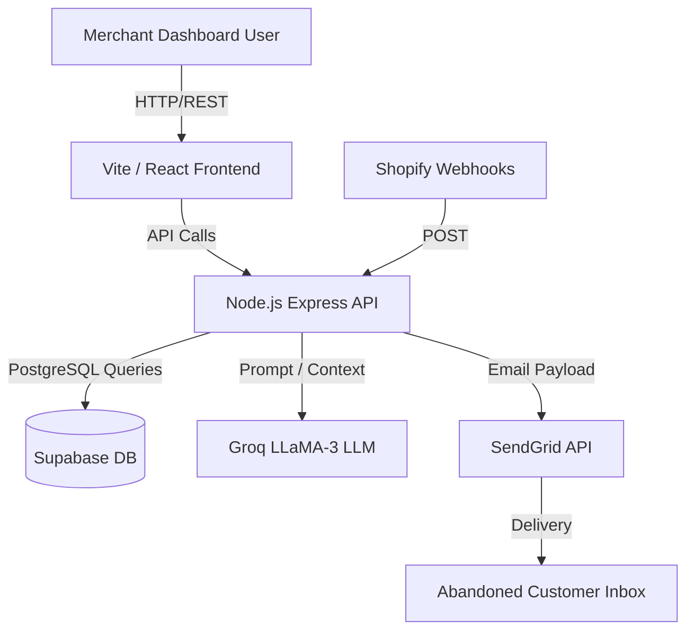

# RecoverAI Technical Document

## 1. System Architecture
RecoverAI is built as a modern, high-performance Monorepo containing a Vite/React frontend and a Node.js/Express backend, sharing a centralized database schema.

### 1.1 Architecture Diagram

## 2. Tech Stack
- **Frontend Workspace:** React 18, Vite, TailwindCSS, Recharts, Lucide Icons, React Query, shadcn/ui.
- **Backend Workspace:** Node.js, Express, TypeScript, Zod validation.
- **Database Workspace:** Drizzle ORM, Supabase (PostgreSQL).
- **AI Engine:** Groq API running LLaMA-3 (70B) for ultra-fast, low-latency prompt generation.
- **Email Delivery:** SendGrid Mail API.
- **Hosting:** Render (Backend API), Vercel (Frontend Dashboard).

## 3. Monorepo Structure
The application is structured using `npm` workspaces to ensure seamless type-sharing and modularity:
- `@workspace/recoveryai-dashboard` (Frontend)
- `@workspace/api-server` (Backend)
- `@workspace/api-client-react` (Shared Axios Client)
- `@workspace/api-zod` (Shared validation schemas)
- `@workspace/db` (Drizzle ORM definitions and connections)

## 4. Key Endpoints
- `GET /api/kpis`: Aggregates realtime revenue recovered and margin protection stats.
- `POST /api/simulate`: The core AI engine endpoint. Receives cart parameters, runs the deterministic escalation logic bounded by LLaMA reasoning, logs the interaction to Supabase, and dispatches the payload via SendGrid.

## 5. Deployment Flow
The monorepo is fully configured for automated continuous deployment. 
- **API:** Render auto-detects the monorepo structure, runs `npm install`, and boots using `tsx` to natively resolve ES modules across workspaces.
- **Frontend:** Vercel builds the Vite workspace and seamlessly communicates with the Render API via dynamic origin routing.
